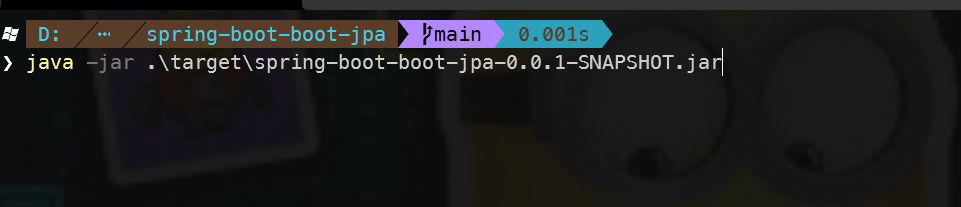
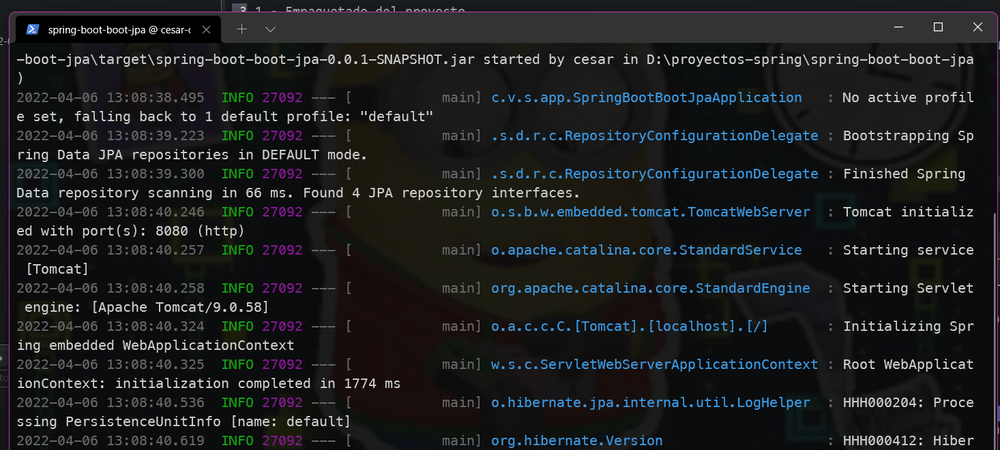
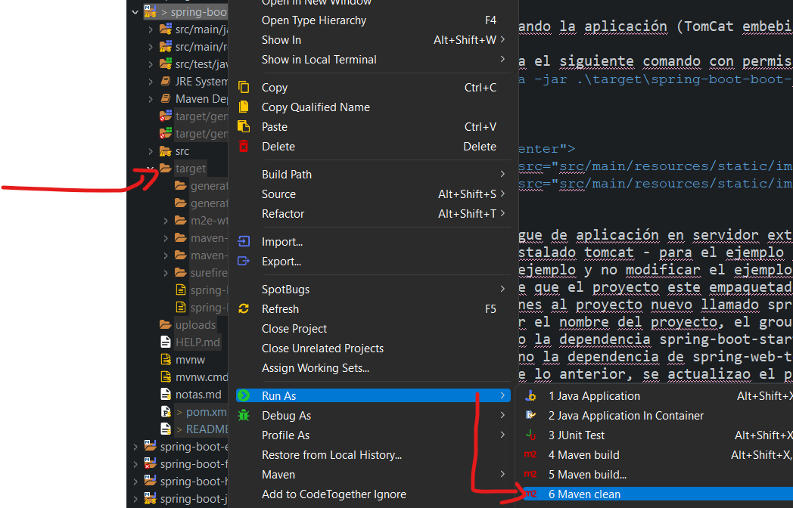
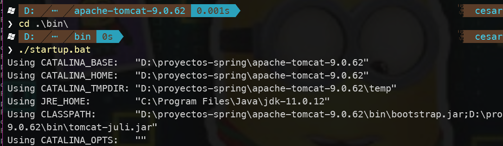
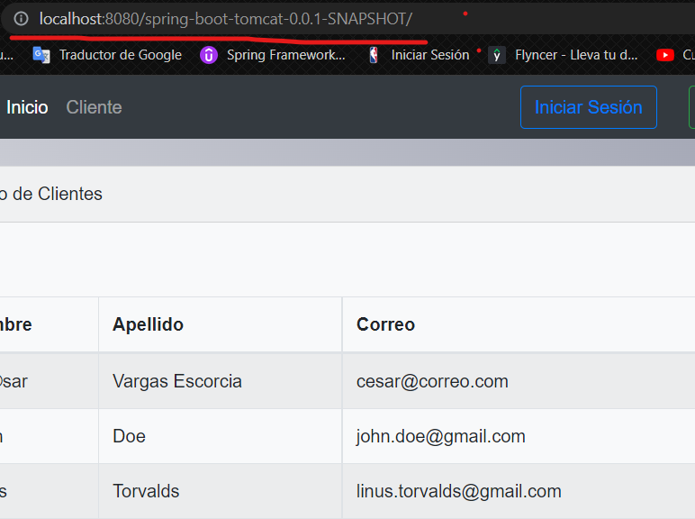
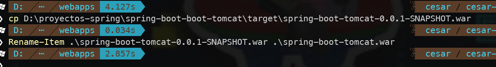

### Despliegue de nuestra aplicación 

1.- Empaquetado del proyecto
	- En la raíz del proyecto ejecutar el comado maven install
	- El empaquetado del proyecto se genera y al terminar de construise se guarda en la carpeta target
	
2.- Desplegando la aplicación (TomCat embebido)

+ Se ejecuta el siguiente comando con permisos de administrador en línea de comandos:  
	- 	java -jar .\target\spring-boot-boot-jpa-0.0.1-SNAPSHOT.jar <br/>
	<br/>

	
<p align="center">
       <br/><br/>
      
</p>
	
3.- Despliegue de aplicación en servidor externo Tomcat
 + Tener instalado tomcat - para el ejemplo se decargo la versión 9 de tomcat y se guardo en el directorio del proyecto en local
 * Para el ejemplo y no modificar el ejemplo actual, se a copiado este porque para desplegar la aplicación en un servidor externo
 se requiere que el proyecto este empaquetado como war por lo cual en el archivo pom.xml se han rralizado las siguientes modificaciones al proyecto nuevo llamado spring-boot-tomcat
 - Renombrar el nombre del proyecto, el groupId, el artefactId, ademas de agregar el packaging como war
 - Se agrego la dependencia spring-boot-starter-tomcat
 - Se elimino la dependencia de spring-web-tool
- Después de lo anterior, se actualizao el proyecto con maven
- Se debe de asegurar que la carpeta target este vacía, de no ser así, en la raíz del proyecto se ejecuta el comando maven clean - después de ejecutar el comando refrescar la carpeta
- ServletInitializer: se requiere crear una clase en la raíz del proyecto, la cual va tener como función indicarle al servidor externo cual es la clase que arranca nuestra aplicación 
- maven install: se empaqueta nuestra aplicación 



```
<groupId>com.vaescode.springboot.tomcat.app</groupId>
	<artifactId>spring-boot-tomcat</artifactId>
	<version>0.0.1-SNAPSHOT</version>
	<packaging>war</packaging>
	<name>spring-boot-tomcat</name>
	

<dependency>
		<groupId>org.springframework.boot</groupId>
		<artifactId>spring-boot-starter-tomcat</artifactId>
		<scope>provided</scope>
</dependency>
``` 		
```

## Despliegue de aplicación en tomcat externo

### Inicializar servidor tomcat externo

- Dirigirse al directorio donde se tiene descargado y descomprimido tomcat
- Ingresar a la carpeta bin
- Dentro de la carpeta bin ejecutar el comando  " .\startup.bat " 
	- Esto inicializa el servidor abriendo una terminal en la cúal se identifica su ejecución	
		
	
	
### Despliegue de aplicación
- Mover nuestro archivo war de la aplicación al directori0 webapp de tomcat y lo copiamos. En automatico y con tomcat levantado nuestra aplicación se desplegara
		
- Revisamos en el navegador nuestro proyecto, hay que estar atentos a la ruta, ya que tomcat desplegra el proyecto con el nombre del proyecto, el cual se genero al empquetar el proyecto: spring-boot-tomcat-0.0.1-SNAPSHOT
	
- Se puede renombrar el proyecto
		

	
	
	
	
	
	